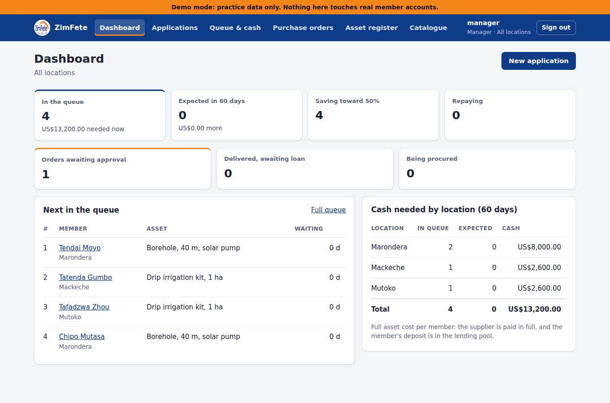
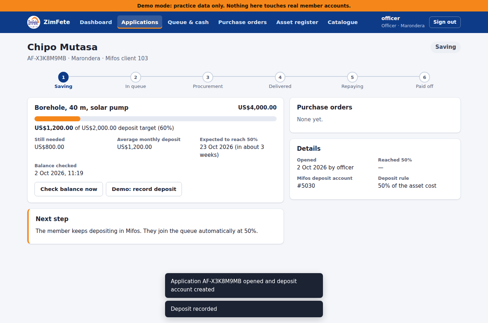
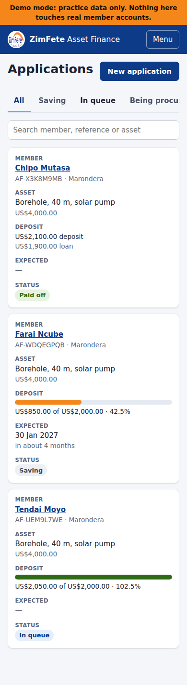

# ZimFete Asset Finance: staff web app

Screens for asset finance officers, managers and administrators, for the [asset-financing service](../asset-financing). It's built with React + TypeScript (Vite). Staff sign in with their **Mifos username and password**.

| Dashboard | Application | Phone |
|---|---|---|
|  |  |  |

## Screens

| Screen | Who | What |
|---|---|---|
| **Dashboard** | everyone | Queue size and cash needed now, members expected to reach 50% within 60 days, cash needed per location; for managers, orders awaiting approval and deliveries awaiting conversion |
| **Applications** | everyone | Filter by stage and location, search. Each row shows progress to 50% and the expected date |
| **New application** | officers | Search the member (from Mifos), pick the asset (and a supplier quote), see the 50% deposit, open it. This creates the deposit account in Mifos |
| **Application page** | everyone | A step tracker and the one *next step* for the current stage and your role: raise purchase order → approve → record delivery (GPS, serial, photos, member's confirmation) → convert to loan. Managers can also change the price or cancel |
| **Queue & cash** | everyone | The ranked queue across all locations with a running cash total, plus a 30/60/90/180-day forecast |
| **Purchase orders** | managers approve | Orders by status. You can't approve an order you raised yourself |
| **Asset register** | everyone | Every financed asset: map link, photos, inspections, ownership; managers can record a repossession |
| **Catalogue** | admins edit | Assets with standard prices, suppliers, and supplier quotes |

Officers only ever see their own location; Head Office users get a location filter. Every screen works on a phone. Tables become cards, and the delivery and inspection forms use the phone's GPS and camera.

## Try it without Mifos (demo mode)

Demo mode runs the backend against a built-in pretend Fineract, with sample members at different stages. Use it for training.

```bash
# terminal 1: backend (Java 21)
cd ../asset-financing
mvn spring-boot:run -Dspring-boot.run.profiles=demo

# terminal 2: this app (Node 20+)
npm install
npm run dev            # http://localhost:5173
```

Sign in as `officer` (Marondera), `officer2` (Hwedza), `manager`, `manager2` or `admin`. The password is the same as the username. In demo mode the application page shows extra **Demo:** buttons that stand in for Mifos teller actions: *record deposit* and *repay loan in full*. Demo data is lost when the backend restarts.

## Tests

```bash
npm test               # unit tests (Vitest)
npm run build          # type-check + production build
# end-to-end, against the backend in demo mode:
npm run build && npm run preview &   # http://localhost:4173
npx playwright install chromium      # first time only
npm run e2e
```

The end-to-end test walks one member through every stage, switching between officer and manager. It runs from application through deposits, queue, purchase order and maker-checker approval, delivery with a photo, and conversion, to repayment and ownership. It also checks location scoping and that phones don't scroll sideways.

## Deploy (Oracle Cloud VM, next to Fineract)

The app and the API **must be served from the same address** because login uses a secure session cookie. Nginx does this:

1. `npm ci && npm run build`, then copy `dist/` to `/var/www/zimfete-assets/` on the server.
2. Copy `deploy/nginx.conf` to `/etc/nginx/sites-available/` (change the domain) and `deploy/security-headers.conf` to `/etc/nginx/snippets/zimfete-security-headers.conf`. Get a certificate with certbot, then run `sudo nginx -t && sudo systemctl reload nginx`. The config was tested with Nginx: app routes, API, caching and the Content-Security-Policy, with the full browser test run through it.
3. Run the backend as described in `../asset-financing/README.md`. Keep `COOKIE_SECURE=true` (the default).
4. Open only ports 80/443 in the Oracle security list.

To update: rebuild, then replace the files in `/var/www/zimfete-assets/`. No restart is needed.

## How it talks to the API

- `src/api/client.ts`: `fetch` wrapper. It sends the session cookie, adds the `X-XSRF-TOKEN` header on every change (CSRF protection), and turns server errors into readable messages. A 401 sends you back to the sign-in page.
- `src/api/hooks.ts`: one hook per screen's data (TanStack Query). After any change, all cached data is refreshed so every screen agrees.
- `src/api/types.ts`: the JSON shapes returned by the backend.
- In development, Vite forwards `/api` to `localhost:8090` (`vite.config.ts`).
